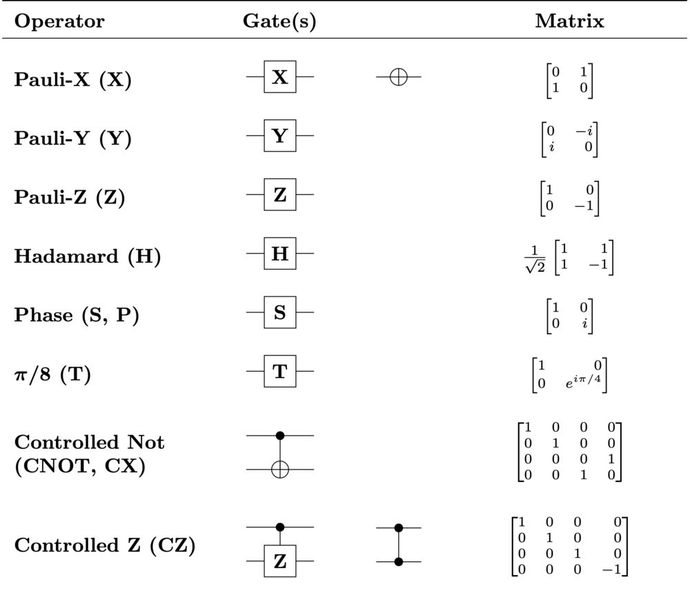

# QNano 

QNano is a lightweight 2-qubit quantum circuit simulator and gate compiler written in Rust. 

It's designed for rapid prototyping and provides a straightforward look into state-vector manipulation.

## Key Features
* **Universal quantum gates:** It can perform any quantum computation possible on two qubits. See [supported gates](#supported-gates).

* **Four state vectors:** Tracks ∣00⟩, ∣01⟩, ∣10⟩, ∣11⟩.

* **Complex phases:** Uses [Complex64](https://docs.rs/num-complex/latest/num_complex/struct.Complex.html) to track amplitudes.

* **Entanglement Support:** Full CX gate implementation allows for the creation of entangled qubits.

* **Custom .qnano DSL:** A simple text-based assembly language for defining and loading quantum circuits.

## Supported gates

Currently supported quantum gates:

* H (Hadamard)

* X (Pauli-X / NOT)

* Z (Pauli-Z / Phase-flip)

* S (Phase / 90° rotation)

* T (T-gate / 45° rotation)

* CX (Controlled-NOT / CNOT)

* CZ (Controlled-Z)

## Future improvements

Currently a work in progress.

* Implement Measure-gate and history
* Quantum circuit visualization using Ratatui (see )
* Writing qnano programs in the console
* Error messages

## Reference

Quantum universal gates:

enum Gate {
    H(usize),          // Superposition
    X(usize),          // Bit-flip (NOT)
    Z(usize),          // Phase-flip
    S(usize),          // 90-degree phase shift
    T(usize),          // 45-degree phase shift (Crucial for universality)
    CX(usize, usize),  // Controlled-NOT
    CZ(usize, usize),  // Controlled-Z
    Measure,           // Collapses the state
}